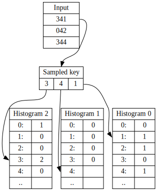

# Notes on Radix Sorting and Implementation

_TODO: These notes (and code) are incomplete. My goal is to eventually provide a step-by-step
guide and introduction to a simple radix sort implementation, and try to cover
the basic issues which are sometimes glossed over in text books and courses.
Furthermore, WHILE THIS NOTE PERSISTS, I MAY FORCE PUSH TO MASTER_

These are my notes on engineering a [radix sort](https://en.wikipedia.org/wiki/Radix_sort).

The ideas behind radix sorting are not new in any way, but seems to have become,
if not forgotten, so at least under-utilized, as over the years _quicksort_ became
the [go-to](https://cs.stackexchange.com/questions/3/why-is-quicksort-better-than-other-sorting-algorithms-in-practice) "default" sorting algorithm
for [internal sorting](https://en.wikipedia.org/wiki/Internal_sort).

Unless otherwise specified, this code is written foremost to be clear and easy to understand.

All code is provided under the [MIT License](LICENSE).

[](https://github.com/eloj/radix-sorting/actions/workflows/c-cpp.yml)

## Table of Contents

+ [Motivation](#motivation)
+ [Building](#building)
+ [From the top; Counting sort](#counting-sort)
    + [Listing 1](#listing_cs8): In-place
    + [Listing 2](#listing_cs8s): Stepping stone
    + [Listing 3](#listing_csrec): Sorting records, stable
+ [All together now; Radix sort](#radix-sort)
    + [Listing 4](#listing_rs32): 32-bit unrolled
    + [Listing 5](#listing_rs64): 64-bit and beyond
+ [Immutability / Returning indeces](#by-rank)
    + [Listing 6](#listing_rs32ranks): Rank sort
+ [Key derivation](#key-derivation)
    + [Sort order](#ordering)
    + [Signed integer keys](#signed-keys)
    + [Floating point keys](#float-keys)
+ [Optimizations](#optimizations)
    + [Hybrids](#hybrids)
    + [Pre-sorted detection](#sort-detection)
    + [Column skipping / Trivial Passes](#column-skipping)
    + [Key compaction](#key-compaction)
    + [Histogram memory](#histogram-memory)
    + [Wider or narrower radix](#radix-width)
    + [Key rewriting](#key-rewriting)
    + [Prefetching](#prefetching)
    + [SIMD and Vectorization](#vectorization)
+ [C++ Implementation](#cpp-implementation)
    + [Benchmarks](#cpp-benchmark)
+ [Downsides](#downsides)
+ [Esoterics](#esoterics)
    + [Uniquely sorting with bitmaps](#bm-unique)
    + [Listing 7](#listing_bm16): Bitmap sort
+ [Todo](#todo)
+ [Contributors](#contributors)
+ [Resources](#resources)

## <a name="motivation"></a> Motivation

This code can sort 40 million 32-bit integers in under half a second using a single
core of an [Intel i5-3570T](https://ark.intel.com/products/65521/Intel-Core-i5-3570T-Processor-6M-Cache-up-to-3_30-GHz),
a low-TDP CPU from 2012 using DDR3-1333. `std::sort` requires ~3.5s for the same task (with the
caveat that it's _in-place_).

## <a name="building"></a> Building

The included `Makefile` will build all the code on any reasonably up-to-date linux installation.

```bash
$ make
```

The default build enables a lot of compiler warning flags and optimizations, but care
has been taken to make sure the examples are easy to build and run individually too;

```bash
$ cc radix_sort_u32.c -o example1
$ ./example1
```

The `radix` program and the benchmark expects a file named `40M_32bit_keys.dat` to exist. This file is
generated by running `make bench` or `make genkeys`.

See the section on [C++ Implementation](#cpp-implementation) for more information on how to use the test program
and benchmark.

## <a name="counting-sort"></a> From the top; Counting sort

Possibly the simplest way to sort an array of integers, is to simply count how many there are
of each, and use those counts to write the result.

This is the most basic [counting sort](https://en.wikipedia.org/wiki/Counting_sort).

<a name="listing_cs8"></a>[Listing 1](counting_sort_8.c):

```c
static void counting_sort_8(uint8_t *arr, size_t n)
{
	size_t cnt[256] = { 0 };
	size_t i;

	// Count number of occurrences of each octet.
	for (i = 0 ; i < n ; ++i) {
		cnt[arr[i]]++;
	}

	// Write cnt_a a's to the array in order.
	i = 0;
	for (size_t a = 0 ; a < 256 ; ++a) {
		while (cnt[a]--)
			arr[i++] = a;
	}
}
```

You could easily extend this code to work with 16-bit values, but if you try to push much further the drawbacks
of this counting sort become fairly obvious; you need a location to store the count for each unique
integer. For 8- and 16-bit numbers this would amount to `2^8*4`=1KiB and `2^16*4`=256KiB of memory. For
32-bit integers, it'd require `2^32*4`=16GiB of memory[^footcntsize]. Multiply by two if you need 64- instead of 32-bit counters.

Again, we're only sorting an array of integers, nothing more. It's not immediately obvious how we could
use this to sort records with multiple pieces of data.

[^footcntsize]: As the wikipedia page explains, it's really the maximum difference of the keys involved that matters.
  Some implementations can be seen scanning the input data to determine and allocate just enough entries to fit
  either `max(key) + 1`, or tighter, `max(key) - min(key) + 1` keys. However, unless you do this because you
  allocate memory on each sort call and just want to save some, you will most likely have to consider what to do
  if the input range is too wide to handle, which is not a good position to be in. In practice you would _never_
  want to fail on some inputs, which makes that type of implementation not very useful.

As presented, this sort is _in-place_, but since it's not moving any elements, it doesn't really make sense
to think of it as being _stable_ or  _unstable_.

An [in-place sort](https://en.wikipedia.org/wiki/In-place_algorithm) is a sorting algorithm where the amount of
extra memory used does not depend on the size of the input.

A [stable sort](https://en.wikipedia.org/wiki/Sorting_algorithm#Stability) is one where records with equal keys keep
their relative position in the sorted output.

To get us closer to radix sorting, we now need to consider a slightly more general variant where we're, at
least conceptually, rearranging input elements:

<a name="listing_cs8s"></a>[Listing 2](counting_sort_8s.c):

```c
static void counting_sort_8s(uint8_t *arr, uint8_t *aux, size_t n)
{
	size_t cnt[256] = { 0 };
	size_t i;

	// Count number of occurrences of each octet.
	for (i = 0 ; i < n ; ++i) {
		cnt[arr[i]]++;
	}

	// Calculate prefix sums.
	size_t a = 0;
	for (int j = 0 ; j < 256 ; ++j) {
		size_t b = cnt[j];
		cnt[j] = a;
		a += b;
	}

	// Sort elements
	for (i = 0 ; i < n ; ++i) {
		// Get the key for the current entry.
		uint8_t k = arr[i];
		// Find the location this entry goes into in the output array.
		size_t dst = cnt[k];
		// Copy the current entry into the right place.
		aux[dst] = arr[i];
		// Make it so that the next 'k' will be written after this one.
		// Since we process source entries in increasing order, this makes us a stable sort.
		cnt[k]++;
	}
}
```

We have introduced a separate output array, which means we are no longer _in-place_. This auxiliary
array is required; the algorithm would break if we tried to write directly into the input array.

However, the _main_ difference between this and the first variant is that we're no longer directly writing the
output from the counts. Instead the counts are re-processed into a [prefix sum](https://en.wikipedia.org/wiki/Prefix_sum)
(or _exclusive scan_) in the second loop.

This gives us, for each input value, its first location in the sorted output array, i.e
the value of `cnt[j]` tells us the array index at which to write the first _j_ to the output, because `cnt[j]`
contains the <em>sum count</em> of all elements that would precede ('sort lower than') _j_.

For instance, `cnt[0]` will always be zero, because any `0` will always end up in the first
position in the output (we're assuming only non-negative integers for now). `cnt[1]` will contain
how many zeroes precede the first `1`, `cnt[2]` will contain how many zeroes _and_ ones precede
the first `2`, and so on.

In the sorting loop, we look up the output location for the key of the entry we're sorting, and write the
entry there. We then increase the count of the prefix sum for that key by one, which guarantees that
the next same-keyed entry is written just after.

Because we are processing the input entries in order, from the lowest to the highest index, and preserving
this order when we write them out, this sort is in essence _stable_. That said, it's a bit of a pointless distinction
since without any other data associated with the keys, there's nothing that distinguishes same keys from one another.

With a few basic modifications, we arrive at:

<a name="listing_csrec"></a>[Listing 3](counting_sort_rec_sk.c):

```c
static void counting_sort_rec_sk(struct sortrec *arr, struct sortrec *aux, size_t n)
{
	size_t cnt[256] = { 0 };
	size_t i;

	// Count number of occurrences of each key.
	for (i = 0 ; i < n ; ++i) {
		uint8_t k = key_of(arr + i);
		cnt[k]++;
	}

	// Calculate prefix sums.
	size_t a = 0;
	for (int j = 0 ; j < 256 ; ++j) {
		size_t b = cnt[j];
		cnt[j] = a;
		a += b;
	}

	// Sort elements
	for (i = 0 ; i < n ; ++i) {
		// Get the key for the current entry.
		uint8_t k = key_of(arr + i);
		size_t dst = cnt[k];
		aux[dst] = arr[i];
		cnt[k]++;
	}
}
```

We are now sorting an array of `struct sortrec`, not an array of octets. The name and the type of the struct
here is arbitrary; it's only used to show that we're not restricted to sorting _arrays of integers_.

The primary modification to the sorting function is the small addition of a function `key_of()`, which returns
the key for a given record.

The main insight you should take away from this is that, to sort record types, we just need some way to
_extract_ or _derive_ a key for each entry.

We're still restricted to integer keys. We rely on there being some sort of mapping from our records (or _entries_)
to the integers which orders the records the way we require.

Here we still use a single octet inside the `struct sortrec` as the key. Associated with each key
is a short string. This allows us to demonstrate that *a)* sorting keys with associated data is not a problem,
and *b)* the sort is indeed stable.

Running the full program demonstrates that each _like-key_ is output in the same order it came in the
input array, i.e the sort is _stable_.

```console
$ ./counting_sort_rec_sk
00000000: 1 -> 1
00000001: 2 -> 2
00000002: 3 -> 3
00000003: 45 -> 1st 45
00000004: 45 -> 2nd 45
00000005: 45 -> 3rd 45
00000006: 255 -> 1st 255
00000007: 255 -> 2nd 255
```

Now we are ready to take the step from counting sorts to radix sorts.

## <a name="radix-sort"></a> All together now; Radix sort

On a high level, the [radix sort](https://www.nist.gov/dads/HTML/radixsort.html) we'll
cover next uses the counting sort we have already discussed, but overcome the inherent
limitation of counting sorts to deal with large magnitude (or _wide_) keys by using
multiple passes, each pass processing only a part of the key.

Some texts describe this as looking at the individual digits of an integer key, which
you can process digit-by-digit via a series of modulo (remainder) and division operations
with the number 10, the base or [radix](https://en.wikipedia.org/wiki/Radix).

In a computer we deal with bits, which means the base is inherently two, not ten.

Because working with individual bits is in some sense "slow", we group multiple of
them together into units that are either faster and/or more convenient to work with.
One such grouping is into strings of eight bits, called octets or [bytes](https://en.wikipedia.org/wiki/Byte).

An octet can represent `2^8` or `256` different values. In other words, just
as processing a base-10 number digit-by-digit is operating in radix-10, processing
a binary number in units of eight bits means operating in radix-256.

Since we're not going to do any math with the keys, it may help to conceptually
consider them simply as _bit-strings_ instead of numbers. This gets rid of some
baggage which isn't useful to the task at hand.

Because we're using a computer and operate on bits, instead of division and modulo
operations, we use _bit-shifts_ and _bit-masking_.

Below is a table of random 32-bit keys written out in [hexadecimal](https://en.wikipedia.org/wiki/Hexadecimal), or base-16,
which is a convenient notation for us.
In hexadecimal a group of four bits is represented with a symbol (digit) from 0-F (0-9 plus A-F), and
consequently a group of eight bits is represented by two such symbols.

 | 32-bit key | A  | B  | C  | D  |
 | :--------- | -- | -- | -- | -- |
 | 7A8F97A4   | 7A | 8F | 97 | A4 |
 | F728B2E2   | F7 | 28 | B2 | E2 |
 | 517833CD   | 51 | 78 | 33 | CD |
 | 9332B72F   | 93 | 32 | B7 | 2F |
 | A35138CD   | A3 | 51 | 38 | CD |
 | BBAD9DAF   | BB | AD | 9D | AF |
 | B2667C54   | B2 | 66 | 7C | 54 |
 | 8C8E59A6   | 8C | 8E | 59 | A6 |

If you consider this table, with the four 8-bit wide columns marked *A* through *D*, there's a choice to be made;
if we're going to process these keys top to bottom, one column at a time, _in which order do we process the columns_?

This choice gives rise to the _two main classes_ of radix sorts, those that are _Least Significant Bits_ (LSB, _bottom-up_)
first and those that are _Most Significant Bits_ (MSB, [_top-down_](https://www.nist.gov/dads/HTML/topdownRadixSort.html)) first.
Sometimes 'digit' is substituted for 'bits', it's the same thing.

If you have prior experience you may already know that, based on the material presented so far,
we're going down the LSB path, meaning we'll process the columns from right to left; D, C, B, A.

In our counting sorts, the key width and the radix (or column) width were the same; 8-bits.
In a radix sort the column width will be less or equal to the key width, and in a LSB radix sort
we'll be forced to make multiple passes over the input to make up the difference. The wider
our radix the more memory (to track counts), but fewer passes we'll need. This is a tradeoff.

The assertion then, and we will demonstrate this to be true, is that if we apply counting sort
by column *D*, and then apply counting sort on that result by column *C*, and so forth, after the last
column (*A*) is processed, our data will be sorted and this sort is stable.

This is radix sort.

<a name="listing_rs32"></a>[Listing 4](radix_sort_u32.c):

```c
static void radix_sort_u32(struct sortrec *arr, struct sortrec *aux, size_t n)
{
	size_t cnt0[256] = { 0 };
	size_t cnt1[256] = { 0 };
	size_t cnt2[256] = { 0 };
	size_t cnt3[256] = { 0 };
	size_t i;

	// Generate histograms
	for (i = 0 ; i < n ; ++i) {
		uint32_t k = key_of(arr + i);

		uint8_t k0 = (k >> 0) & 0xFF;
		uint8_t k1 = (k >> 8) & 0xFF;
		uint8_t k2 = (k >> 16) & 0xFF;
		uint8_t k3 = (k >> 24) & 0xFF;

		++cnt0[k0];
		++cnt1[k1];
		++cnt2[k2];
		++cnt3[k3];
	}

	// Calculate prefix sums.
	size_t a0 = 0;
	size_t a1 = 0;
	size_t a2 = 0;
	size_t a3 = 0;
	for (int j = 0 ; j < 256 ; ++j) {
		size_t b0 = cnt0[j];
		size_t b1 = cnt1[j];
		size_t b2 = cnt2[j];
		size_t b3 = cnt3[j];
		cnt0[j] = a0;
		cnt1[j] = a1;
		cnt2[j] = a2;
		cnt3[j] = a3;
		a0 += b0;
		a1 += b1;
		a2 += b2;
		a3 += b3;
	}

	// Sort in four passes from LSB to MSB
	for (i = 0 ; i < n ; ++i) {
		uint32_t k = key_of(arr + i);
		uint8_t k0 = (k >> 0) & 0xFF;
		size_t dst = cnt0[k0]++;
		aux[dst] = arr[i];
	}
	SWAP(arr, aux);

	for (i = 0 ; i < n ; ++i) {
		uint32_t k = key_of(arr + i);
		uint8_t k1 = (k >> 8) & 0xFF;
		size_t dst = cnt1[k1]++;
		aux[dst] = arr[i];
	}
	SWAP(arr, aux);

	for (i = 0 ; i < n ; ++i) {
		uint32_t k = key_of(arr + i);
		uint8_t k2 = (k >> 16) & 0xFF;
		size_t dst = cnt2[k2]++;
		aux[dst] = arr[i];
	}
	SWAP(arr, aux);

	for (i = 0 ; i < n ; ++i) {
		uint32_t k = key_of(arr + i);
		uint8_t k3 = (k >> 24) & 0xFF;
		size_t dst = cnt3[k3]++;
		aux[dst] = arr[i];
	}
}
```

The function `radix_sort_u32()` builds on `counting_sort_rec_sk()` in a straight-forward manner
by introducing four counting sort passes. The outer (pass) loop is _unrolled_ by design, to show off the pattern.

The four histograms are generated in one pass through the input. These are re-processed into prefix sums
in a separate step. A speed vs memory trade-off can be had by not pre-computing all the histograms.

We then sort columns *D* through *A*, swapping (a.k.a ping-ponging) the
input and output buffer between the passes.

After the 4:th (final) sorting pass, since this is an even number, the final result is available
in the input buffer.

A quick performance note: Having four distinct arrays for the histograms will almost certainly generate imperfect code,
e.g you're likely to end up with separate calls to `memset`.

Extending to larger keys, e.g 64-bit keys and beyond, can be achieved by simply adding more passes,
but for completeness, let us instead look at how we can augment the function to sort in multiple passes via
a _key-shift_ argument, as this is a very common implementation detail:

<a name="listing_rs64"></a>[Listing 5](radix_sort_u64_multipass.c):

```c
struct sortrec {
	uint64_t key;
	const char *name;
};

static uint64_t key_of(const struct sortrec *rec) {
	return rec->key;
}

static void radix_sort_u32_multipass(struct sortrec *arr, struct sortrec *aux, size_t n, unsigned int keyshift)
{
	size_t cnt0[256] = { 0 };
	size_t cnt1[256] = { 0 };
	size_t cnt2[256] = { 0 };
	size_t cnt3[256] = { 0 };
	size_t i;

	// Generate histograms
	for (i = 0 ; i < n ; ++i) {
		uint32_t k = key_of(arr + i) >> keyshift;
```

At each point we retrieve the key via `key_of`, we shift out any bits we've already processed in a previous pass,
passed in as `keyshift`.

We can then sort 64-bit wide by calling the sort function twice as such:

```c
	radix_sort_u32_multipass(arr, aux, N, 0);
	radix_sort_u32_multipass(arr, aux, N, 32);
```

The first call will sort on bits 0-31 of the key, the second call on bits 32-63.

This is only possible because the sort is stable.

## <a name="by-rank"></a>Immutability / Returning indeces

So far we've mostly had our code rearrange the values in the input array itself,
but it's sometimes desirable to be able to treat the input as immutable.

The obvious solution is to generate an array of pointers into the input and then sort
those pointers. This is usually how we do things when sorting record types (or strings)
in a C-style language, since rearranging these implies copying a lot of data, which can be expensive,
and because we can have multiple pointer arrays representing different sort orders over the same input.

An alternative is to sort using indeces instead. You can think of it as assigning
a number between `0` and `N-1` to each object to be sorted, and then returning a permutation
of these numbers that represents the sorted order. Some know this by the name _argsort_.

Example: Take as input the array `A = { 2, 42, 1 }`. Assuming zero-based indexing, the rank-array representing
an ascending sort of the input is `R = { 2, 0, 1 }`. I.e `{ A[R[0]], A[R[1]], A[R[2]], ... A[R[N-1]]}` = `{ 1, 2, 42, ... }`

Having the sort return indeces is also useful if we need to sort something which is split over
different arrays, since the result can be applied to the original input as well as any 'parallel'
arrays. This is demonstrated in the example code below, where we decouple `name` from
the struct whose key we're sorting on.

So the goal is to modify our sorting function to return `R` instead of permuting `A`. We can achieve this with quite minor changes:

<a name="listing_rs32ranks"></a>[Listing 6](radix_sort_u32_ranks.c):

```c
static uint32_t *radix_sort_u32_index(const struct sortrec * const arr, uint32_t *indeces, size_t n)
[...]
	// Sort in four passes from LSB to MSB
	for (i = 0 ; i < n ; ++i) {
		uint8_t k0 = key_of(arr + i);
		size_t dst = cnt0[k0]++;
		indeces2[dst] = i;
	}

	for (i = 0 ; i < n ; ++i) {
		uint8_t k1 = key_of(arr + indeces2[i]) >> 8;
		size_t dst = cnt1[k1]++;
		indeces[dst] = indeces2[i];
	}
[...]
	return indeces;
```

First note in the prototype that we declare the input array as _const_. This
means we can't write to `arr`, and hence we guarantee that the input is undisturbed.

Instead of the old `aux` array we accept an array `indeces`, which has been allocated to be twice
the number of entries to be sorted. It's twice the _length_ of the original array because we
still need space to ping-pong reads and writes while sorting, and the input array is
no longer available for writing.

In the first pass we read the input in order and write out indeces in the correct positions in
the indeces buffer. In subsequent passes we alternate reading via, and writing the indeces buffers.

As with sorting via pointers, the extra indirection from looking up the key via the indeces array is
likely to have _quite_ negative implications for performance due to the added data-dependency.
[There are solutions to this](http://www.codercorner.com/blog/wp-content/uploads/2018/03/radixredux.pdf),
which we'll have to revisit here at a later date.

On the plus side, we have now decoupled the size of the auxiliary buffer(s) from the size of
the objects in the input array. Yes, we need to allocate a buffer twice the _length_ of that
when we're sorting by value, but we only need room for two indeces per entry, so the _size_
of the auxilary buffer(s) is directly related to the number of objects being sorted. So for example,
if we're sorting fewer than 2^16 objects, we can use 16-bit indeces to save space and improve
cache behaviour.

## <a name="key-derivation"></a> Key derivation

First let's get the question of sorting strings out of the way.

LSB radix sort is inherently columnar. The keys must all be the same width, and narrower is
better to keep the number of passes down. To sort variable length keys you would first
have to pad all keys on the left (MSD) side until they're the length of the longest key.

This is to say, an LSB implemention is not well suited to sort character strings of any
significant length. For those, a [MSB radix sort](https://github.com/eloj/radix-string-sorting) is better.

For sorting floats, doubles or other fixed-width keys, or changing the sort order,
we can still use the LSB implementation as-is. The trick is to map the keys onto
the unsigned integers.

I'll use the term _key-derivation_ for this, because we're not only extracting different
parts of a key; using this function to manipulate the key in different ways to derive a sort key
is how we're able to handle signed integers, floating point keys, and chose a sort order.

### <a name="ordering"></a> Sort order

The natural ordering for the unsigned integers is in _ascending_ order. If we instead want to sort
in _descending_ (reverse) order, simply have the _key-derivation_ function return the bitwise inverse
(or [complement](https://en.wikipedia.org/wiki/Bitwise_operation#NOT)) of the key:

```c
	return ~key; // unsigned (desc)
```

Note that for like-keys, the first record in the _forward-direction_ of the input will also be the
first record in the output. If this is not what you want, I suggest using a standard ascending sort
and reading the result backwards, which obviously will give you the _last_ like-key record first.

### <a name="signed-keys"></a>Signed integer keys

To treat the key as a signed integer, we need to manipulate the sign-bit,
which is the top-most 'most significant' bit, since by default this is set for negative numbers, meaning they would appear
at the end of the result. Using the [xor operator](https://en.wikipedia.org/wiki/Bitwise_operation#XOR) we flip the top bit, which
neatly solves the problem:

```c
	return key ^ (1UL << 31); // signed 32-bit (asc)
```

These can be combined to handle signed integers in descending order:

```c
	return ~(key ^ (1UL << 31)); // signed 32-bit (desc)
```

### <a name="float-keys"></a>Floating point keys

To sort IEEE 754 single-precision (32-bit) floats (a.k.a [binary32](https://en.wikipedia.org/wiki/Single-precision_floating-point_format)) in their natural order we need to invert the key if the sign-bit is set, else we need to flip the sign bit. (via [Radix Tricks](http://stereopsis.com/radix.html)):

```c
	return key ^ (-(key >> 31) | (1UL << 31)); // 32-bit float (asc)
```

This looks complex, but the left side of the parenthetical converts a set sign-bit to an all-set bitmask (-1 equals ~0) which causes the `xor` to
invert the whole key. The second expression in the parenthetical (after the bitwise or) sets the sign bit, which is a no-op if it was already set, but
otherwise ensures that the `xor` flips the sign-bit only.

As an implementation detail for C and C++, `key` is the floating point key reinterpreted as an unsigned 32-bit integer to allow
the bit-manipulation. This sort of _type-punning_, if done naively, can be considered _undefined behaviour_ (UB). Post C++20 you should
have the option to use `bit_cast<T>()` to do this in a well-defined way, but without that option we instead use `memcpy` into a local
temporary. This pattern is recognized by compilers, but as always you should inspect the generated code to make sure.

Example for sorting `{ 128.0f, 646464.0f, 0.0f, -0.0f, -0.5f, 0.5f, -128.0f, -INFINITY, NAN, INFINITY }`:

```console
00000000: ff800000 -inf
00000001: c3000000 -128.000000
00000002: bf000000 -0.500000
00000003: 80000000 -0.000000
00000004: 00000000 0.000000
00000005: 3f000000 0.500000
00000006: 43000000 128.000000
00000007: 491dd400 646464.000000
00000008: 7f800000 inf
00000009: 7fc00000 nan
```

So yes, you can sort with NaNs. Isn't life great?

All of these of course extends naturally to 64-bit keys, just change the shifts from 31 to 63 and adjust the types involved accordingly.

## <a name="optimizations"></a> Optimizations

In this section I'll talk about some optimizations that I have tried, or
that may be worth investigating.

At this point it must be noted that none of the code in this repository
even attempts to defeat [side-channel leaks](https://en.wikipedia.org/wiki/Side-channel_attack),
and some of the following optimizations add data-dependencies that will definitely open
the door for [timing attacks](https://en.wikipedia.org/wiki/Timing_attack) should
you apply them in a cryptographic context.

### <a name="hybrids"></a> Hybrids

I have observed a few different radix sort implementations, and some of them have
a larger _fixed overhead_ than others. This gives rise to the idea of hybrid sorts,
where you redirect small workloads (e.g N < 100) to say an _insertion sort_.
This is often a part of MSB radix sorts.

It's also possible to do one MSB pass and then LSB sort the sub-results. This saves
memory and memory management from doing all MSB passes, and should improve cache
locality for the LSB passes. In the one implementation I've tried, the
fixed overhead was quite high. (_TODO: experiment/determine exact reason_)

### <a name="sort-detection"></a> Pre-sorted detection

Since we have to scan once through the input to build our histograms, it's
relatively easy to add code there to detect if the input is already sorted/reverse-sorted,
and special case that.

One way to implement it is to initialize a variable to the number of elements
to be sorted, and decrement it every time the current element is _less-than-or-equal_
to the next one, care of bounds. After a pass through the input, you would have
a count of the number of elements that need to be sorted. If this number is less
than two, you're done.

If there's a user-defined key-derivation function, apply it to the values being
compared.

Pushing further, say trying to detect already sorted columns, didn't seem worth the
effort in my experiments. You don't want to add too many conditionals to the
histogram loop.

### <a name="column-skipping"></a >Column skipping / Trivial Passes

If every key has the same value for a key-radix aligned portion, then the sort loop for that column will
simply be a copy from one buffer to another, which is a waste.

Fortunately detecting a 'trivial pass' is easy, and does not -- as is sometimes shown -- require a loop over the
histogram _looking_ for a non-zero count and checking if it's equal the number of keys being sorted.

Instead we can simply _sample any key_, and check the corresponding histogram entries directly.



We take the first key (any will do), extract all the subkeys using whatever key-radix we're using,
and then we _directly probe_ those entries in the histogram(s). No searching required.

Iff the corresponding count is equal to the number of keys to be sorted, all the values in
the column are the same and it can be skipped.

[EASTL](https://github.com/electronicarts/EASTL/blob/e757b44f712902a78fe22886842eaba25e0a7797/include/EASTL/sort.h#L1648) use this optimization.

Notice how you could sample _any_ key, and the result would be the same.

```c
	int cols[4];
	int ncols = 0;
	uint32_t key0 = key_of(*src); // sample first entry
	uint8_t k0 = (key0 >> 0);
	uint8_t k1 = (key0 >> 8);
	[...]
	if (cnt0[k0] != num_entries)
		cols[ncols++] = 0;
	if (cnt1[k1] != num_entries)
		cols[ncols++] = 1;
	[...]
	// .. here the cols array contains the index of the ncols columns we must process.
```

Unlikely to be a win in the common case, but as a potential micro-optimization you could `xor` any
two keys and ignore histograms for which the combined bits are not all zero.

Skipping columns has the side-effect of the final sorted result ending up in either the
original input buffer or the auxiliary buffer, depending on whether you sorted an even
or odd number of columns. I prefer to have the sort function return the pointer
to the result, rather than add a copy step.

### <a name="key-compaction"></a >Key compaction

_This section is [under development](https://github.com/eloj/binary-search-kdf#related-work), speculative, and has not been implemented_

The opportunity for column-skipping is fast and easy to detect, and efficient
when activated, but suffers from limited opportunity in practice due to the
requirement that every input entry has the same value in the column. The
higher the radix (wider column), the fewer opportunities for skipping.

If we reduced the column width to one single bit, then any column with
all 0s or all 1s could be skipped, at the cost of having to do key-width
number of passes worst-case.

The insight here is that we only care about columns with mixed values, so we
should never have to do more passes than there are such columns. The problem
is that we do not want to use radix-1 because looking at a single bit at a
time is not efficient in practice.

However, this gives rise to the following idea; we should be able to re-arrange
the bit-columns in the key, as long as we preserve the relative order of the
underlying sort keys, such that we maximize opportunity for column skipping.

In other words, if we know which 1-bit columns are relevant, i.e those which
are not all the same bit-value, then we could partition the keys such that all
relevant columns move to towards the LSB, and all irrelevant towards the MSB,
and as long as we preserve the relative order of _relevant columns_, this should
create opportunity for a wider radix to skip columns at the MSB end of the key.

Calculating a mask of which columns are relevant can be done efficiently in one pass
using simple bit-operations. We already do this pass to generate histograms, so little
performance is lost here.

The mask tells us the maximum amount of bit-compaction that can be achieved,
and so we can decide to skip it if it wouldn't expose any whole radix-N columns.

One basic first approach would be to use the mask to shift out/ignore low bits that
are the same, as long as we can shift enough that a full column becomes available for skipping.

More optimally, the mask can be used together with a parallel bit-extraction instruction,
where available, to pack the keys. On AMD64 this instruction is called `PEXT`
and is part of the [BMI2 instruction set](https://en.wikipedia.org/wiki/Bit_manipulation_instruction_set#BMI2_(Bit_Manipulation_Instruction_Set_2)).

This is an active [area of research](https://github.com/eloj/binary-search-kdf/blob/master/relbits.cpp).

### <a name="histogram-memory"></a> Histogram memory

Unlike a typical implementation, which would likely repeatedly call
a counting sort and therefore need as many histogramming passes as there are
sorting passes, the idea of pre-calculating the histograms for multiple sorting
passes at once comes naturally when writing the radix sort in the _unrolled_ form.

Reducing the size of the histograms by using the smallest counter type possible
will have a positive performance impact due to better cache utilization.
If you can get away with 32-bit or even 16-bit counters, it will almost certainly
pay off. In an experiment, halving the histogram size by changing the counter type
from `size_t` to `uint32_t` improved performance when sorting N<100 items by ~33%.
This effect fades out as the input size grows in proportion to the histograms.

It's possible to do the histogramming for the _next pass_ within the sort loop
of the _current pass_, reducing the memory footprint to two histogram buffers
in the unrolled form.

EASTL, while having a conventional outer sorting loop, uses this fusing approach anyway,
[noting that it](https://github.com/electronicarts/EASTL/blob/e757b44f712902a78fe22886842eaba25e0a7797/include/EASTL/sort.h#L1644) "_avoids memory traffic / cache pressure of reading keys in a separate operation_".

### <a name="radix-width"></a> Wider or narrower radix

Using multiples of eight bits for the radix is convenient, but not required. If we do,
we limit ourselves to 8-bit or 16-bit wide radixes in practice. Using an intermediate size
such as 11-bits with three passes saves us one pass for every 32-bits of key and may
fit a low-level cache (L1/L2) better, but also makes it less likely for the column skipping
to kick in, and adds a few extra masking operations.

Going narrower could allow us to skip more columns in common workloads. There's definitely
room for experimentation in this area, maybe even trying non-uniformly wide radixes (8-16-8) or
dynamic selection of radix widths. If the data you're sorting isn't random, adapting the
radix to the data may yield positive results, e.g if you know you are sorting floats in
the range -1 to +1, or only care about a certain number of bits of precision, then this may be exploitable.

That said, in my limited initial testing, neither 4- nor 11-bit wide radix showed any promise
at all in sorting _random_ 32-bit integers. Quite the contrary, both were bad across the board.

The 4-bit version never had much going for it, so no big surprise there. Perhaps if you have
to sort on a tiny microprocessor it may be worth going down in radix, but on a modern "big CPU"
I'm confident saying it is not.

The 11-bit version on the other hand was surprisingly bad, and was never even close to beating
the standard 8-bit radix implementation, even when reducing the counter width down to 32-bits
to compensate for the larger number of buckets. This variant is one you sometimes see in the wild,
and I can guarantee you that it's _almost_ certainly a pessimization over just using octets.

My current interpretation as to why, is that increasing L1D cache pressure with larger histograms is
actually detrimental to overall performance.

There is perhaps a world with bigger caches and faster memory where going wider is better,
but for now it seems eight bits reigns supreme.

### <a name="key-rewriting"></a> Key rewriting

Instead of applying the key-derivation function on each access, you could
parameterize the sort on two functions; One to rewrite the input buffer _into_
the desired key-derivation, and the other to transform the final output buffer
_back_ to the original form.

The savings are supposed to come from not having to apply the key-derivation function
to each key during the intermediate sorting passes. In my testing a performance increase
from this micro-optimization -- rewriting in the histogramming loop and the last sorting
pass -- could not be measured even at 40 million keys. It's possible that this is worth
it on less capable hardware.

It's also possible to change the underlying code instead of manipulating the key. You
can reverse the sort-order by reversing the prefix sum, or simply reading the final
result backwards if possible.

The 2000-era [Radix Sort Revisited](http://codercorner.com/RadixSortRevisited.htm) presents
a direct way to change the code to handle floats.

### <a name="prefetching"></a> Prefetching

Working primarily on IA-32 and AMD64/x86-64 CPUs, I've never had a good experience with
adding manual prefetching (i.e `__builtin_prefetch`).

[Michael Herf](http://stereopsis.com/radix.html) reports a "25% speedup" from adding `_mm_prefetch` calls
to his code that was running on a Pentium 3.

I'll put this in the *TBD* column for now.

### <a name="vectorization"></a> SIMD and Vectorization

See "[Prefix Sum with SIMD](https://en.algorithmica.org/hpc/algorithms/prefix/)" for various
approaches to using SIMD (AVX2 specifically) to calculate prefix sums.

There are optimized histogram functions [out there](https://gist.github.com/rygorous/a86a5cf348922cdea357c928e32fc7e0),
and with newer instruction set extensions it certainly seems more viable, but I have yet to personally explore this space.

For other architectures this may be more or less viable.

## <a name="cpp-implementation"></a> C++ Implementation

_TODO: This code is very much a work in progress, used to test various techniques, and does NOT represent a final 'product'._

[radix_sort.hpp](radix_sort.hpp)
[radix_tests.cpp](radix_tests.cpp)

By default we build an executable called `radix`. This is a test harness of sorts, with some options
to let you test different setups.

```bash
$ ./radix
Usage: ./radix <count> [<use_mmap> <use_huge> <uint8_t|uint16_t|uint32_t|uint64_t|int32_t|int64_t|float|double> <hex-mask>]
```

The first argument is the number of integers to sort (from `40M_32bit_keys.dat`), with zero
meaning all:

```bash
$ ./radix 0
```

To sort all the available data as unsigned 16-bit integers using `mmap` for memory allocation, and forcing a column skip:

```bash
$ ./radix 0 1 0 uint16_t 0x00ff
```

The second argument is a flag controlling the use of `mmap` to map the input file and allocate memory. Defaults to `0`.

The third argument is a flag that controls the use of [hugepages](https://www.kernel.org/doc/Documentation/vm/hugetlbpage.txt),
i.e very large memory pages. The presence of this feature is not guaranteed, and allocation may fail on some systems when
used in combination with `mmap`. Defaults to `0`.

The fourth argument is the `type`, i.e, what type to interpret the input file as an array of. Defaults to `uint32_t`.

The fifth argument is a mask expressed in hexadecimal that will be bitwise `AND`-ed against the input before it's
sorted. This can be used to demonstrate the column-skipping functionality, e.g by passing 0x00FFFFFF the MSD column
should be skipped. Defaults to no masking.

### <a name="cpp-benchmark"></a> Benchmarks

The `bench` Make target will build and run a benchmark comparing the (WIP) C++ implementation against `std::sort` and stdlib `qsort`.

[radix_bench.cpp](radix_bench.cpp)

This code is built on top of and requires the prior installation of the [Google benchmark](https://github.com/google/benchmark) microbenchmark support library,
which is available as `libbenchmark-dev` on Debian and Ubuntu.


It's not worth talking about specific numbers at this point in time, but some general notes are in order.

You will notice that there's a cut-off point, usually after a few hundred or so keys, where radix sort
starts beating the other algorithms. This is due to the overhead of initializing, generating and
accessing histograms. We can always implement a hybrid which switches to a sort that handles small inputs better,
giving us the best of both worlds.

The cost of allocating the auxiliary sorting buffer is not included in the timings by default. If you care
about that the benchmark can be easily updated to move the aux buffer allocation into the benchmark loop.
In practice, repeated allocation and deallocation of the same-sized block is likely to be immaterial,
especially when there is little other pressure on the memory allocator during the benchmark.

Because we're sorting random data, the column-skipping optimization and pre-sorted detection is extremely
unlikely to kick in, so while the benchmark is realistic, it is by no means a best-case scenario.

## <a name="downsides"></a> Downsides

The main downside to _out-of-place_ implementations is that the natural interface is different from
"regular" _in-place_ sorts. This becomes a problem when you need to conform to _pre-existing interfaces_ in e.g
programming language standard libraries and tools. You can work around this in various ways, but this either sacrifices
performance, or complicates the implementation. Take the hit of allocating and deallocating the auxilary storage every call,
or keep a lazily or pre-allocated, and possibly growing, block of memory around that can be reused.

They are also, as a general rule, not great for very small inputs.

## <a name="esoterics"></a> Esoterics

### <a name="bm-unique"></a> Uniquely sorting with bitmaps

Consider what it would mean if in a counting sort, instead of a typical 32- or 64-bit counter, we only had one bit per integer.

Instead of an array of counters, we have a bitmap. Instead of increasing a counter each time we see a value,
we simply mark it off as present in the bitmap.

This would only work if there were zero or one occurrence of each possible input value. More correctly; it would
only work if we're okay with removing any duplicates in the input, leaving only unique values.

<a name="listing_bm16"></a>[Listing 7](bitmap_sort_16.c):

```c
static void bitmap_sort_16(uint16_t *arr, uint64_t *bitmap, size_t n)
{
	// Mark integers as present in bitmap
	for (size_t i = 0 ; i < n ; ++i) {
		bitmap[arr[i] >> 6] |= (1UL << (arr[i] & 63));
	}
}
```

Since we're using a single bit per value we have extend the magnitude of keys we can handle
per unit memory by a factor of 32 or 64. We can now go up to 24-bit keys in only 2MiB memory.

Jon Bentley originally presented a scenario where this approach could be useful in his book [Programming Pearls, 2nd ed](https://archive.org/details/ProgrammingPearls2ndEditionJonBentley/page/n229),
section 1.2, and his Dr.Dobb's column [Algorithm Alley](http://www.drdobbs.com/architecture-and-design/algorithm-alley/184411142?pgno=1).

## <a name="todo"></a> TODO

+ More graphs, performance metrics.
+ The other path: [MSB Radix String Sorting](https://github.com/eloj/radix-string-sorting)
+ Buc--ket sort
+ Ame--rican Flag Sort

## <a name="misc"></a> Miscellaneous

* Asserting on histogram counter overflow.

## <a name="contributors"></a> Contributors

* Eddy Jansson - [@el0j](https://mastodon.gamedev.place/@el0j) - [github](https://github.com/eloj)

## <a name="resources"></a> Resources

* Pierre Terdiman, "[Radix Sort Revisited](http://codercorner.com/RadixSortRevisited.htm)", 2000.
* Pierre Terdiman, "[Radix Redux](http://www.codercorner.com/blog/wp-content/uploads/2018/03/radixredux.pdf)", 2008 (PDF).
* Michael Herf, "[Radix Tricks](http://stereopsis.com/radix.html), 2001.

